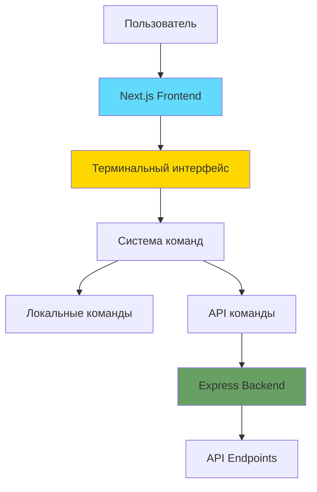
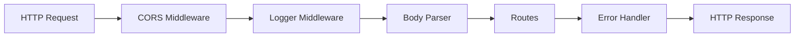

# Архитектура проекта SinShell

## Обзор

SinShell - это терминал-стилизованный веб-сайт, построенный на современном стеке технологий с разделением на frontend и backend части.

## Технологический стек

### Frontend
- **Framework**: Next.js 14+ (App Router)
- **Language**: TypeScript
- **Styling**: Tailwind CSS
- **State Management**: React Context API
- **HTTP Client**: Fetch API / Axios

### Backend
- **Framework**: Express.js
- **Language**: TypeScript
- **Runtime**: Node.js 18+
- **Middleware**: CORS, body-parser, morgan (logging)

## Архитектура системы



## Структура проекта

```
sinshell/
├── frontend/
│   ├── src/
│   │   ├── app/                    # Next.js App Router
│   │   │   ├── layout.tsx          # Root layout
│   │   │   ├── page.tsx            # Home page
│   │   │   └── globals.css         # Global styles
│   │   ├── components/             # React компоненты
│   │   │   ├── Terminal/           # Терминальные компоненты
│   │   │   │   ├── Terminal.tsx    # Главный компонент терминала
│   │   │   │   ├── Input.tsx       # Поле ввода команд
│   │   │   │   ├── Output.tsx      # Вывод результатов
│   │   │   │   └── Prompt.tsx      # Промпт терминала
│   │   │   └── ui/                 # UI компоненты
│   │   ├── lib/                    # Утилиты и хелперы
│   │   │   ├── commands/           # Система команд
│   │   │   │   ├── index.ts        # Регистр команд
│   │   │   │   ├── help.ts         # Команда help
│   │   │   │   ├── about.ts        # Команда about
│   │   │   │   ├── clear.ts        # Команда clear
│   │   │   │   └── theme.ts        # Команда theme
│   │   │   ├── api.ts              # API клиент
│   │   │   └── themes.ts           # Конфигурация тем
│   │   ├── context/                # React Context
│   │   │   ├── TerminalContext.tsx # Контекст терминала
│   │   │   └── ThemeContext.tsx    # Контекст темы
│   │   └── types/                  # TypeScript типы
│   │       ├── terminal.ts         # Типы терминала
│   │       └── commands.ts         # Типы команд
│   ├── public/                     # Статические файлы
│   ├── config.json                 # Конфигурация приложения
│   ├── package.json
│   ├── tsconfig.json
│   ├── tailwind.config.ts
│   └── next.config.js
│
├── backend/
│   ├── src/
│   │   ├── index.ts                # Точка входа
│   │   ├── app.ts                  # Express приложение
│   │   ├── config/                 # Конфигурация
│   │   │   └── index.ts            # Настройки приложения
│   │   ├── routes/                 # API маршруты
│   │   │   ├── index.ts            # Главный роутер
│   │   │   ├── info.ts             # Информационные endpoints
│   │   │   └── health.ts           # Health check
│   │   ├── controllers/            # Контроллеры
│   │   │   └── infoController.ts   # Контроллер информации
│   │   ├── middleware/             # Middleware
│   │   │   ├── errorHandler.ts    # Обработка ошибок
│   │   │   └── logger.ts           # Логирование
│   │   └── types/                  # TypeScript типы
│   │       └── index.ts            # Общие типы
│   ├── package.json
│   └── tsconfig.json
│
├── docs/                           # Документация
│   ├── ARCHITECTURE.md             # Этот файл
│   └── API.md                      # API документация
├── package.json                    # Root package.json
└── README.md
```

## Компоненты Frontend

### 1. Terminal Component
Главный компонент терминала, управляющий состоянием и отображением.

**Ответственность:**
- Управление историей команд
- Обработка ввода пользователя
- Отображение вывода команд
- Управление фокусом на поле ввода

**Состояние:**
```typescript
interface TerminalState {
  history: HistoryEntry[];
  currentInput: string;
  theme: Theme;
}

interface HistoryEntry {
  command: string;
  output: React.ReactNode;
  timestamp: Date;
}
```

### 2. Command System
Модульная система команд с возможностью расширения.

**Интерфейс команды:**
```typescript
interface Command {
  name: string;
  description: string;
  usage: string;
  execute: (args: string[], context: CommandContext) => Promise<CommandOutput>;
}

interface CommandContext {
  api: APIClient;
  theme: Theme;
  setTheme: (theme: Theme) => void;
  clear: () => void;
}

interface CommandOutput {
  type: 'text' | 'html' | 'error';
  content: React.ReactNode;
}
```

### 3. Theme System
Система тем с поддержкой множественных цветовых схем.

**Темы:**
- `default` - Классическая зеленая терминальная тема
- `dracula` - Популярная темная тема
- `monokai` - Тема в стиле Monokai
- `nord` - Минималистичная северная тема

**Структура темы:**
```typescript
interface Theme {
  name: string;
  colors: {
    background: string;
    foreground: string;
    cursor: string;
    selection: string;
    prompt: string;
    command: string;
    output: string;
    error: string;
  };
}
```

## Backend API

### Endpoints

#### 1. Health Check
```
GET /api/health
Response: { status: 'ok', timestamp: string }
```

#### 2. System Info
```
GET /api/info
Response: {
  name: string;
  version: string;
  uptime: number;
  environment: string;
}
```

#### 3. About
```
GET /api/about
Response: {
  title: string;
  description: string;
  author: string;
  links: { name: string; url: string }[];
}
```

### Middleware Stack



## Поток данных

### Выполнение команды

```mermaid
sequenceDiagram
    participant User
    participant Terminal
    participant CommandSystem
    participant API
    participant Backend

    User->>Terminal: Вводит команду
    Terminal->>CommandSystem: Парсит и находит команду
    
    alt Локальная команда
        CommandSystem->>Terminal: Выполняет локально
        Terminal->>User: Отображает результат
    else API команда
        CommandSystem->>API: Отправляет запрос
        API->>Backend: HTTP Request
        Backend->>API: HTTP Response
        API->>CommandSystem: Возвращает данные
        CommandSystem->>Terminal: Форматирует результат
        Terminal->>User: Отображает результат
    end
```



## Команды

### Локальные команды

1. **help** - Показывает список доступных команд
   - Не требует API
   - Отображает все зарегистрированные команды

2. **clear** - Очищает терминал
   - Не требует API
   - Очищает историю вывода

3. **theme [name]** - Меняет тему оформления
   - Не требует API
   - Без аргументов показывает доступные темы
   - С аргументом применяет выбранную тему

### API команды

1. **about** - Информация о сайте
   - Запрос: `GET /api/about`
   - Отображает информацию из backend

2. **projects** - Список проектов (будущее расширение)
   - Запрос: `GET /api/projects`

3. **contact** - Контактная информация (будущее расширение)
   - Запрос: `GET /api/contact`

## Конфигурация

### Frontend Config (`frontend/config.json`)
```json
{
  "site": {
    "title": "SinShell",
    "description": "Terminal styled website",
    "prompt": "visitor@sinshell:~$"
  },
  "api": {
    "baseUrl": "http://localhost:5000/api"
  },
  "banner": {
    "ascii": "ASCII art here",
    "message": "Welcome message"
  },
  "social": [
    { "name": "GitHub", "url": "https://github.com/..." }
  ]
}
```

### Backend Config (`backend/src/config/index.ts`)
```typescript
export const config = {
  port: process.env.PORT || 5000,
  env: process.env.NODE_ENV || 'development',
  cors: {
    origin: process.env.CORS_ORIGIN || 'http://localhost:3000'
  }
};
```

## Стилизация

### Tailwind CSS классы для терминала

```css
/* Основной контейнер терминала */
.terminal-container {
  @apply bg-black text-green-400 font-mono p-4 rounded-lg shadow-2xl;
  @apply min-h-screen overflow-auto;
}

/* Строка вывода */
.terminal-line {
  @apply mb-2 whitespace-pre-wrap break-words;
}

/* Промпт */
.terminal-prompt {
  @apply text-blue-400 font-bold;
}

/* Поле ввода */
.terminal-input {
  @apply bg-transparent border-none outline-none text-green-400;
  @apply font-mono w-full;
}

/* Курсор */
.terminal-cursor {
  @apply inline-block w-2 h-5 bg-green-400 animate-pulse;
}
```

## Производительность

### Оптимизации Frontend
- Виртуализация истории команд для больших объемов вывода
- Мемоизация компонентов с React.memo
- Debounce для автокомплита команд
- Lazy loading для тяжелых компонентов

### Оптимизации Backend
- Кэширование статических данных
- Compression middleware для ответов
- Rate limiting для защиты от злоупотреблений

## Безопасность

### Frontend
- Санитизация пользовательского ввода
- XSS защита через React
- CSP (Content Security Policy) заголовки

### Backend
- CORS настройка
- Helmet.js для безопасных заголовков
- Rate limiting
- Input validation

## Развертывание

### Frontend (Vercel)
```bash
# Автоматическое развертывание при push в main
# Root directory: frontend
# Build command: npm run build
# Output directory: .next
```

### Backend (Railway/Render)
```bash
# Root directory: backend
# Build command: npm run build
# Start command: npm start
# Environment variables: PORT, NODE_ENV, CORS_ORIGIN
```

## Будущие улучшения

1. **Аутентификация**
   - JWT токены
   - Персонализированные команды
   - История команд пользователя

2. **Расширенные команды**
   - `ls` - список файлов/проектов
   - `cd` - навигация по разделам
   - `cat` - просмотр содержимого
   - `wget` - скачивание файлов

3. **Интерактивность**
   - Автокомплит команд (Tab)
   - История команд (↑/↓)
   - Поиск по истории (Ctrl+R)

4. **Мультиплеер**
   - WebSocket соединение
   - Совместное использование терминала
   - Чат между пользователями

5. **Аналитика**
   - Отслеживание использования команд
   - Метрики производительности
   - Пользовательская аналитика

## Тестирование

### Frontend
- Unit тесты: Jest + React Testing Library
- E2E тесты: Playwright
- Компонентные тесты: Storybook

### Backend
- Unit тесты: Jest
- Integration тесты: Supertest
- API тесты: Postman/Newman

## Мониторинг

- Логирование: Winston/Pino
- Мониторинг ошибок: Sentry
- Метрики производительности: New Relic/DataDog
- Uptime мониторинг: UptimeRobot

---

**Версия документа**: 1.0  
**Дата создания**: 2026-01-23  
**Автор**: Architect Mode