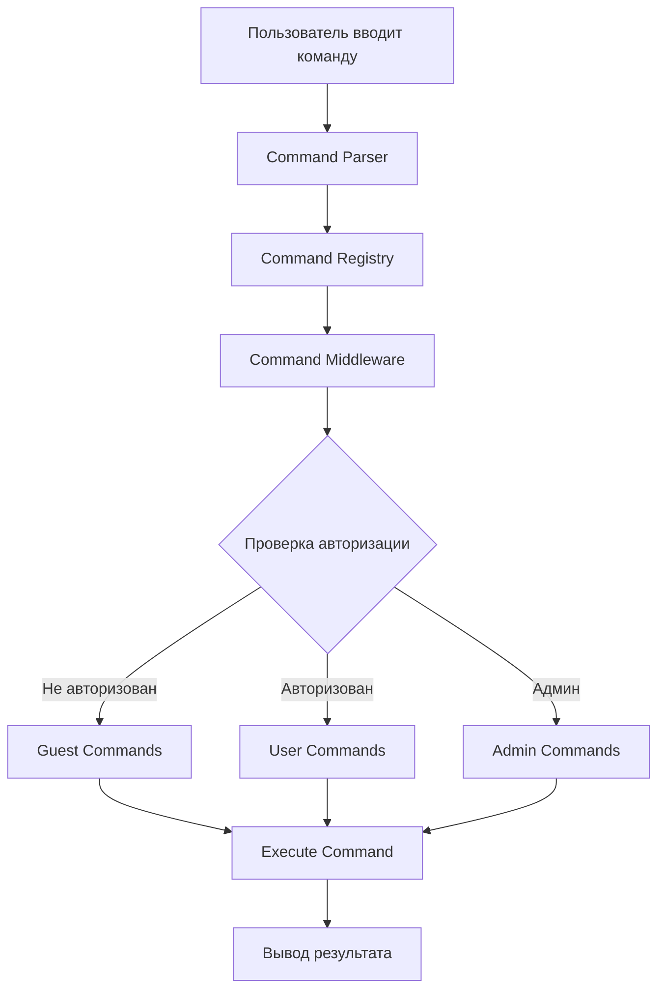

# Система команд SinShell

## Обзор

Система команд в SinShell спроектирована для максимальной гибкости и простоты расширения. Она поддерживает:
- ✅ Легкое добавление/удаление команд
- ✅ Условную доступность команд (авторизация, роли)
- ✅ Динамическую регистрацию команд
- ✅ Middleware для команд
- ✅ Валидацию и права доступа

## Архитектура системы команд



## Структура команды

### Базовый интерфейс

```typescript
// frontend/src/types/commands.ts

/**
 * Базовый интерфейс команды
 */
export interface Command {
  // ========== ОБЯЗАТЕЛЬНЫЕ ПОЛЯ ==========
  
  /** Имя команды (например, "help", "about") */
  name: string;
  
  /** Краткое описание команды для отображения в help */
  description: string;
  
  /** Пример использования (например, "help [command]") */
  usage: string;
  
  /** Категория команды для группировки в help */
  category: CommandCategory;
  
  /** Функция выполнения команды */
  execute: (args: string[], context: CommandContext) => Promise<CommandOutput>;
  
  // ========== ОПЦИОНАЛЬНЫЕ ПОЛЯ (с дефолтами) ==========
  
  /**
   * Альтернативные имена команды
   * @example ['?', 'h'] для команды help
   * @default []
   */
  aliases?: string[];
  
  /**
   * Требуется ли авторизация
   * @default false
   */
  requiresAuth?: boolean;
  
  /**
   * Требуемые роли (проверяется только если requiresAuth = true)
   * @default []
   */
  roles?: UserRole[];
  
  /**
   * Скрыть из списка help
   * @default false
   */
  hidden?: boolean;
}

export enum CommandCategory {
  SYSTEM = 'system',      // Системные команды (help, clear)
  INFO = 'info',          // Информационные (about, contact)
  USER = 'user',          // Пользовательские (profile, settings)
  ADMIN = 'admin',        // Административные
  CUSTOM = 'custom'       // Кастомные
}

export enum UserRole {
  GUEST = 'guest',
  USER = 'user',
  ADMIN = 'admin'
}

/**
 * Применяет дефолтные значения к команде
 */
function normalizeCommand(command: Command): Required<Command> {
  return {
    ...command,
    aliases: command.aliases ?? [],
    requiresAuth: command.requiresAuth ?? false,
    roles: command.roles ?? [],
    hidden: command.hidden ?? false,
  };
}

export interface CommandContext {
  // API клиент
  api: ApiClient;
  
  // Управление терминалом
  clear: () => void;
  addToHistory: (entry: HistoryEntry) => void;
  
  // Тема
  theme: Theme;
  setTheme: (theme: Theme) => void;
  
  // Пользователь
  user?: User;
  isAuthenticated: boolean;
  
  // Утилиты
  print: (content: React.ReactNode) => void;
  printError: (message: string) => void;
}

export interface CommandOutput {
  type: 'text' | 'html' | 'error' | 'success';
  content: React.ReactNode;
}

export interface ValidationResult {
  valid: boolean;
  error?: string;
}
```

## Command Registry - Центральный реестр команд

```typescript
// frontend/src/lib/commands/registry.ts

class CommandRegistry {
  private commands: Map<string, Command> = new Map();
  private aliases: Map<string, string> = new Map();

  /**
   * Регистрация команды
   */
  register(command: Command): void {
    // Регистрируем основное имя
    this.commands.set(command.name.toLowerCase(), command);
    
    // Регистрируем алиасы
    if (command.aliases) {
      command.aliases.forEach(alias => {
        this.aliases.set(alias.toLowerCase(), command.name.toLowerCase());
      });
    }
  }

  /**
   * Удаление команды
   */
  unregister(name: string): void {
    const command = this.commands.get(name.toLowerCase());
    if (command) {
      // Удаляем алиасы
      if (command.aliases) {
        command.aliases.forEach(alias => {
          this.aliases.delete(alias.toLowerCase());
        });
      }
      // Удаляем команду
      this.commands.delete(name.toLowerCase());
    }
  }

  /**
   * Получение команды
   */
  get(name: string): Command | undefined {
    const normalizedName = name.toLowerCase();
    
    // Проверяем алиасы
    const aliasTarget = this.aliases.get(normalizedName);
    if (aliasTarget) {
      return this.commands.get(aliasTarget);
    }
    
    // Возвращаем команду
    return this.commands.get(normalizedName);
  }

  /**
   * Получение всех доступных команд для пользователя
   */
  getAvailableCommands(context: CommandContext): Command[] {
    return Array.from(this.commands.values()).filter(cmd => 
      this.isCommandAvailable(cmd, context)
    );
  }

  /**
   * Проверка доступности команды
   */
  private isCommandAvailable(command: Command, context: CommandContext): boolean {
    // Скрытые команды не показываем
    if (command.hidden) {
      return false;
    }

    // Проверка авторизации
    if (command.requiresAuth && !context.isAuthenticated) {
      return false;
    }

    // Проверка ролей
    if (command.roles && command.roles.length > 0) {
      if (!context.user) {
        return false;
      }
      const hasRole = command.roles.some(role => 
        context.user?.roles.includes(role)
      );
      if (!hasRole) {
        return false;
      }
    }

    return true;
  }

  /**
   * Получение команд по категории
   */
  getByCategory(category: CommandCategory, context: CommandContext): Command[] {
    return this.getAvailableCommands(context).filter(
      cmd => cmd.category === category
    );
  }

  /**
   * Автокомплит
   */
  autocomplete(partial: string, context: CommandContext): string[] {
    const available = this.getAvailableCommands(context);
    return available
      .filter(cmd => cmd.name.startsWith(partial.toLowerCase()))
      .map(cmd => cmd.name);
  }
}

// Экспортируем singleton
export const commandRegistry = new CommandRegistry();
```

## Примеры команд

### 1. Простая команда (доступна всем)

```typescript
// frontend/src/lib/commands/help.ts

import { Command, CommandContext, CommandOutput } from '@/types/commands';
import { commandRegistry } from './registry';

export const helpCommand: Command = {
  name: 'help',
  description: 'Показать список доступных команд',
  usage: 'help [command]',
  aliases: ['?', 'h'],
  category: CommandCategory.SYSTEM,
  
  execute: async (args: string[], context: CommandContext): Promise<CommandOutput> => {
    // Если указана конкретная команда
    if (args.length > 0) {
      const cmd = commandRegistry.get(args[0]);
      if (!cmd) {
        return {
          type: 'error',
          content: `Команда "${args[0]}" не найдена`
        };
      }
      
      return {
        type: 'text',
        content: (
          <div>
            <div className="font-bold">{cmd.name}</div>
            <div>{cmd.description}</div>
            <div className="text-gray-400">Использование: {cmd.usage}</div>
            {cmd.aliases && (
              <div className="text-gray-400">
                Алиасы: {cmd.aliases.join(', ')}
              </div>
            )}
          </div>
        )
      };
    }

    // Показываем все доступные команды
    const commands = commandRegistry.getAvailableCommands(context);
    const grouped = commands.reduce((acc, cmd) => {
      const category = cmd.category || CommandCategory.CUSTOM;
      if (!acc[category]) {
        acc[category] = [];
      }
      acc[category].push(cmd);
      return acc;
    }, {} as Record<CommandCategory, Command[]>);

    return {
      type: 'html',
      content: (
        <div className="space-y-4">
          <div className="font-bold">Доступные команды:</div>
          {Object.entries(grouped).map(([category, cmds]) => (
            <div key={category}>
              <div className="text-blue-400 font-bold capitalize">{category}</div>
              {cmds.map(cmd => (
                <div key={cmd.name} className="ml-4">
                  <span className="text-green-400">{cmd.name}</span>
                  {' - '}
                  <span>{cmd.description}</span>
                </div>
              ))}
            </div>
          ))}
          <div className="text-gray-400 text-sm">
            Используйте "help [команда]" для подробной информации
          </div>
        </div>
      )
    };
  }
};
```

### 2. Команда только для авторизованных

```typescript
// frontend/src/lib/commands/profile.ts

export const profileCommand: Command = {
  name: 'profile',
  description: 'Показать профиль пользователя',
  usage: 'profile',
  category: CommandCategory.USER,
  requiresAuth: true,  // ⭐ Требует авторизации
  
  execute: async (args: string[], context: CommandContext): Promise<CommandOutput> => {
    if (!context.user) {
      return {
        type: 'error',
        content: 'Необходима авторизация. Используйте команду "login"'
      };
    }

    return {
      type: 'html',
      content: (
        <div className="space-y-2">
          <div className="font-bold text-blue-400">Профиль пользователя</div>
          <div>Имя: {context.user.name}</div>
          <div>Email: {context.user.email}</div>
          <div>Роль: {context.user.roles.join(', ')}</div>
          <div>Зарегистрирован: {context.user.createdAt}</div>
        </div>
      )
    };
  }
};
```

### 3. Команда только для администраторов

```typescript
// frontend/src/lib/commands/admin/users.ts

export const usersCommand: Command = {
  name: 'users',
  description: 'Управление пользователями (только для админов)',
  usage: 'users [list|add|remove]',
  category: CommandCategory.ADMIN,
  requiresAuth: true,
  roles: [UserRole.ADMIN],  // ⭐ Только для админов
  
  execute: async (args: string[], context: CommandContext): Promise<CommandOutput> => {
    const action = args[0] || 'list';
    
    try {
      switch (action) {
        case 'list':
          const users = await context.api.get('/admin/users');
          return {
            type: 'html',
            content: (
              <div>
                <div className="font-bold">Список пользователей:</div>
                {users.map(user => (
                  <div key={user.id}>
                    {user.name} ({user.email}) - {user.role}
                  </div>
                ))}
              </div>
            )
          };
          
        case 'add':
          // Логика добавления пользователя
          break;
          
        case 'remove':
          // Логика удаления пользователя
          break;
          
        default:
          return {
            type: 'error',
            content: `Неизвестное действие: ${action}`
          };
      }
    } catch (error) {
      return {
        type: 'error',
        content: `Ошибка: ${error.message}`
      };
    }
  }
};
```

### 4. Команда только для гостей (не авторизованных)

```typescript
// frontend/src/lib/commands/login.ts

export const loginCommand: Command = {
  name: 'login',
  description: 'Войти в систему',
  usage: 'login <username> <password>',
  category: CommandCategory.SYSTEM,
  hidden: false,  // Показываем в help
  
  // Валидация аргументов
  validate: (args: string[]): ValidationResult => {
    if (args.length < 2) {
      return {
        valid: false,
        error: 'Использование: login <username> <password>'
      };
    }
    return { valid: true };
  },
  
  execute: async (args: string[], context: CommandContext): Promise<CommandOutput> => {
    // Если уже авторизован
    if (context.isAuthenticated) {
      return {
        type: 'error',
        content: 'Вы уже авторизованы. Используйте "logout" для выхода.'
      };
    }

    const [username, password] = args;
    
    try {
      const response = await context.api.post('/auth/login', {
        username,
        password
      });
      
      // Сохраняем токен и обновляем контекст
      localStorage.setItem('token', response.token);
      
      return {
        type: 'success',
        content: `Добро пожаловать, ${response.user.name}!`
      };
    } catch (error) {
      return {
        type: 'error',
        content: 'Неверные учетные данные'
      };
    }
  }
};
```

## Динамическая регистрация команд

### Регистрация при инициализации

```typescript
// frontend/src/lib/commands/index.ts

import { commandRegistry } from './registry';

// Системные команды (всегда доступны)
import { helpCommand } from './help';
import { clearCommand } from './clear';
import { themeCommand } from './theme';

// Информационные команды
import { aboutCommand } from './about';
import { contactCommand } from './contact';

// Команды для авторизованных
import { profileCommand } from './profile';
import { settingsCommand } from './settings';

// Команды для админов
import { usersCommand } from './admin/users';
import { logsCommand } from './admin/logs';

// Команды для гостей
import { loginCommand } from './login';
import { registerCommand } from './register';

/**
 * Инициализация команд
 */
export function initializeCommands() {
  // Системные команды
  commandRegistry.register(helpCommand);
  commandRegistry.register(clearCommand);
  commandRegistry.register(themeCommand);
  
  // Информационные
  commandRegistry.register(aboutCommand);
  commandRegistry.register(contactCommand);
  
  // Для авторизованных
  commandRegistry.register(profileCommand);
  commandRegistry.register(settingsCommand);
  
  // Для админов
  commandRegistry.register(usersCommand);
  commandRegistry.register(logsCommand);
  
  // Для гостей
  commandRegistry.register(loginCommand);
  commandRegistry.register(registerCommand);
}

/**
 * Выполнение команды
 */
export async function executeCommand(
  input: string,
  context: CommandContext
): Promise<CommandOutput> {
  // Парсинг команды
  const [commandName, ...args] = input.trim().split(/\s+/);
  
  if (!commandName) {
    return {
      type: 'error',
      content: 'Введите команду'
    };
  }
  
  // Получаем команду
  const command = commandRegistry.get(commandName);
  
  if (!command) {
    return {
      type: 'error',
      content: `Команда "${commandName}" не найдена. Используйте "help" для списка команд.`
    };
  }
  
  // Проверка доступности
  if (command.requiresAuth && !context.isAuthenticated) {
    return {
      type: 'error',
      content: 'Эта команда требует авторизации. Используйте "login".'
    };
  }
  
  // Проверка ролей
  if (command.roles && command.roles.length > 0) {
    if (!context.user) {
      return {
        type: 'error',
        content: 'Недостаточно прав для выполнения этой команды.'
      };
    }
    
    const hasRole = command.roles.some(role => 
      context.user?.roles.includes(role)
    );
    
    if (!hasRole) {
      return {
        type: 'error',
        content: 'Недостаточно прав для выполнения этой команды.'
      };
    }
  }
  
  // Валидация аргументов
  if (command.validate) {
    const validation = command.validate(args);
    if (!validation.valid) {
      return {
        type: 'error',
        content: validation.error || 'Неверные аргументы'
      };
    }
  }
  
  // Выполнение команды
  try {
    return await command.execute(args, context);
  } catch (error) {
    return {
      type: 'error',
      content: `Ошибка выполнения команды: ${error.message}`
    };
  }
}
```

## Добавление команды в runtime

```typescript
// Пример: добавление кастомной команды через API

export async function loadCustomCommands(context: CommandContext) {
  try {
    // Загружаем кастомные команды с сервера
    const customCommands = await context.api.get('/commands/custom');
    
    customCommands.forEach(cmdData => {
      const command: Command = {
        name: cmdData.name,
        description: cmdData.description,
        usage: cmdData.usage,
        category: CommandCategory.CUSTOM,
        requiresAuth: cmdData.requiresAuth,
        roles: cmdData.roles,
        
        execute: async (args: string[], ctx: CommandContext) => {
          // Выполняем команду через API
          const result = await ctx.api.post(`/commands/execute/${cmdData.id}`, {
            args
          });
          
          return {
            type: 'html',
            content: <div dangerouslySetInnerHTML={{ __html: result.output }} />
          };
        }
      };
      
      commandRegistry.register(command);
    });
  } catch (error) {
    console.error('Failed to load custom commands:', error);
  }
}
```

## Использование в компонентах

```typescript
// frontend/src/components/Terminal/Terminal.tsx

import { useEffect } from 'react';
import { initializeCommands, executeCommand } from '@/lib/commands';
import { useAuth } from '@/context/AuthContext';

export const Terminal: React.FC = () => {
  const { user, isAuthenticated } = useAuth();
  
  useEffect(() => {
    // Инициализируем команды при монтировании
    initializeCommands();
  }, []);
  
  const handleCommand = async (input: string) => {
    const context: CommandContext = {
      api,
      clear: () => setHistory([]),
      addToHistory,
      theme,
      setTheme,
      user,
      isAuthenticated,
      print: (content) => addToHistory({ type: 'output', content }),
      printError: (message) => addToHistory({ type: 'error', content: message })
    };
    
    const output = await executeCommand(input, context);
    addToHistory({
      command: input,
      output: output.content,
      type: output.type
    });
  };
  
  // ... остальной код компонента
};
```

## Примеры использования опциональных полей

### Минимальная команда (только обязательные поля)

```typescript
// Самая простая команда - только обязательные поля
export const clearCommand: Command = {
  name: 'clear',
  description: 'Очистить терминал',
  usage: 'clear',
  category: CommandCategory.SYSTEM,
  
  execute: async (args, context) => {
    context.clear();
    return { type: 'success', content: '' };
  }
};
// aliases = [] (по умолчанию)
// requiresAuth = false (по умолчанию)
// roles = [] (по умолчанию)
// hidden = false (по умолчанию)
```

### Команда с алиасами

```typescript
// Команда с несколькими именами
export const helpCommand: Command = {
  name: 'help',
  description: 'Показать справку',
  usage: 'help [command]',
  category: CommandCategory.SYSTEM,
  aliases: ['?', 'h', 'man'],  // ⭐ Можно вызвать как help, ?, h или man
  
  execute: async (args, context) => {
    // ...
  }
};
```

### Команда для авторизованных пользователей

```typescript
// Доступна только после авторизации
export const profileCommand: Command = {
  name: 'profile',
  description: 'Мой профиль',
  usage: 'profile',
  category: CommandCategory.USER,
  requiresAuth: true,  // ⭐ Требует авторизации
  
  execute: async (args, context) => {
    // context.user гарантированно существует
    return {
      type: 'html',
      content: <div>Привет, {context.user.name}!</div>
    };
  }
};
```

### Команда для конкретных ролей

```typescript
// Только для администраторов
export const adminCommand: Command = {
  name: 'admin',
  description: 'Панель администратора',
  usage: 'admin',
  category: CommandCategory.ADMIN,
  requiresAuth: true,
  roles: [UserRole.ADMIN],  // ⭐ Только для админов
  
  execute: async (args, context) => {
    // Доступна только пользователям с ролью ADMIN
  }
};

// Для нескольких ролей
export const moderateCommand: Command = {
  name: 'moderate',
  description: 'Модерация контента',
  usage: 'moderate',
  category: CommandCategory.ADMIN,
  requiresAuth: true,
  roles: [UserRole.ADMIN, UserRole.MODERATOR],  // ⭐ Админы ИЛИ модераторы
  
  execute: async (args, context) => {
    // Доступна админам и модераторам
  }
};
```

### Скрытая команда

```typescript
// Служебная команда, не показывается в help
export const debugCommand: Command = {
  name: 'debug',
  description: 'Отладочная информация',
  usage: 'debug',
  category: CommandCategory.SYSTEM,
  hidden: true,  // ⭐ Не показывается в списке команд
  
  execute: async (args, context) => {
    // Команда работает, но не видна в help
    return {
      type: 'text',
      content: JSON.stringify(context, null, 2)
    };
  }
};
```

### Комбинация всех опций

```typescript
// Команда со всеми возможными настройками
export const superCommand: Command = {
  name: 'super',
  description: 'Супер команда',
  usage: 'super [options]',
  category: CommandCategory.CUSTOM,
  aliases: ['s', 'sup'],           // Алиасы
  requiresAuth: true,              // Требует авторизации
  roles: [UserRole.ADMIN],         // Только для админов
  hidden: false,                   // Показывать в help
  
  execute: async (args, context) => {
    // Полный контроль над доступом
  }
};
```

## Сравнение: когда использовать опциональные поля

| Сценарий | requiresAuth | roles | hidden | aliases |
|----------|--------------|-------|--------|---------|
| Публичная команда (help, about) | ❌ | ❌ | ❌ | ✅ (для удобства) |
| Команда для пользователей (profile) | ✅ | ❌ | ❌ | ❌ |
| Админ команда (users, logs) | ✅ | ✅ [ADMIN] | ❌ | ❌ |
| Служебная команда (debug) | ❌ | ❌ | ✅ | ❌ |
| Команда с сокращениями (help) | ❌ | ❌ | ❌ | ✅ ['?', 'h'] |

## Преимущества системы

### ✅ Легкое добавление команды
```typescript
// 1. Создаем файл команды с минимальными полями
export const myCommand: Command = {
  name: 'mycommand',
  description: 'Моя команда',
  usage: 'mycommand',
  category: CommandCategory.CUSTOM,
  execute: async (args, context) => {
    return { type: 'text', content: 'Hello!' };
  }
};

// 2. Регистрируем в index.ts
commandRegistry.register(myCommand);
```

### ✅ Легкое удаление команды
```typescript
commandRegistry.unregister('commandName');
```

### ✅ Условная доступность
```typescript
// Автоматически скрывается для неавторизованных
requiresAuth: true

// Автоматически скрывается для не-админов
roles: [UserRole.ADMIN]

// Не показывается в help, но работает
hidden: true
```

### ✅ Динамическая загрузка
```typescript
// Загрузка команд с сервера
await loadCustomCommands(context);
```

### ✅ Группировка и категоризация
```typescript
// Автоматическая группировка в help
category: CommandCategory.ADMIN
```

### ✅ Алиасы
```typescript
// Несколько имен для одной команды
aliases: ['?', 'h']
```

## Частые вопросы

**Q: Нужно ли указывать пустой массив для aliases?**
A: Нет, если алиасов нет - просто не указывайте поле. По умолчанию будет `[]`.

**Q: Что если указать requiresAuth: false явно?**
A: Это то же самое, что не указывать поле вообще. Команда будет доступна всем.

**Q: Можно ли сделать команду только для гостей (не авторизованных)?**
A: Да, проверяйте `!context.isAuthenticated` внутри `execute`:
```typescript
execute: async (args, context) => {
  if (context.isAuthenticated) {
    return { type: 'error', content: 'Вы уже авторизованы' };
  }
  // Логика для гостей
}
```

**Q: Как сделать команду доступной только определенным пользователям?**
A: Используйте кастомную проверку в `execute`:
```typescript
execute: async (args, context) => {
  if (context.user?.id !== 'specific-user-id') {
    return { type: 'error', content: 'Недостаточно прав' };
  }
  // Логика команды
}
```

---

**Версия документа**: 1.0
**Дата создания**: 2026-01-23
**Автор**: Architect Mode